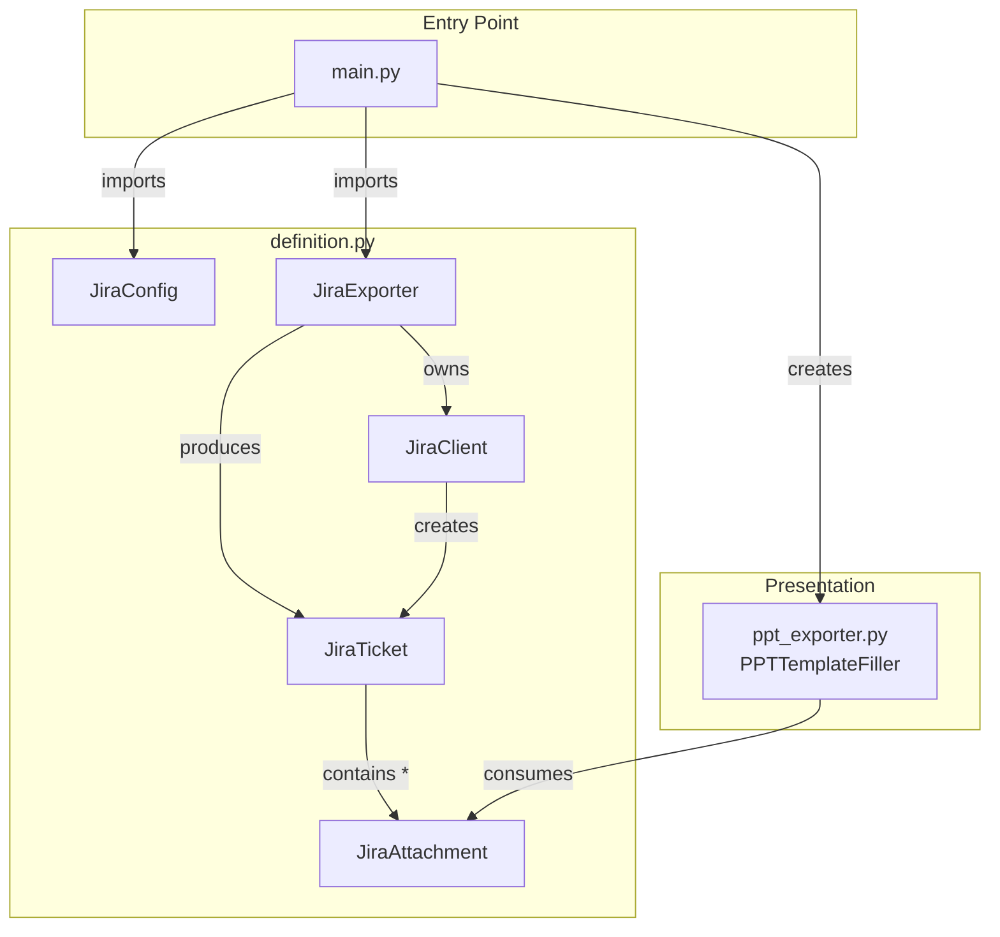
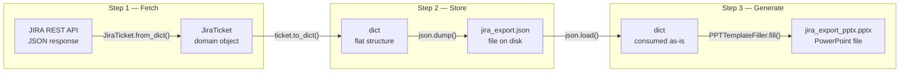

# JIRA Exporter — Detailed Class Design

## 1. Class Overview

```mermaid
classDiagram
    direction LR

    class JiraConfig {
        +str url
        +str email
        +str api_token
        +str project_key
        +str output_file
        +bool ppt_export
        +str ppt_template
        +list~str~ fields
        +from_file(path) JiraConfig
    }

    class JiraAttachment {
        +str filename
        +str mime_type
        +str url
        +int size
        +str created
        +str author
        +is_image bool
    }

    class JiraTicket {
        +str key
        +int id
        +str summary
        +str|None description
        +str status
        +str|None priority
        +str issue_type
        +str project
        +str|None reporter
        +str|None assignee
        +str|None created
        +str|None updated
        +list~str~ labels
        +list~str~ components
        +list~str~ fix_versions
        +list~JiraAttachment~ attachments
        +list~str~ image_urls
        +dict custom_fields
        +from_dict(data) JiraTicket
        +to_dict() dict
        -_extract_text(raw) Any
        -_adf_to_text(adf) tuple
        -_extract_image_urls(desc) list~str~
    }

    class JiraClient {
        -str url
        +Session session
        -str _rest_base
        -_get(path, params) dict
        -_post(path, json_body) dict
        +load_field_names() void
        +search(jql, fields, max_results) list~JiraTicket~
        +get_ticket(key, fields) JiraTicket
    }

    class JiraExporter {
        +JiraConfig config
        +JiraClient client
        -list _last_tickets
        +run(jql) list~dict~
        +export_tickets(keys) list~dict~
        -_write_output(results) void
        -_print_summary(results) void
    }

    class PPTTemplateFiller {
        +Path template_path
        -dict _download_cache
        -Any _session
        +fill(tickets, output_path, attachments_map, session) Path
        -_fill_summary_slide(slide, tickets) void
        -_fill_ticket_slide(slide, ticket, role, attachments_map) void
        -_replace_picture(slide, shape, ticket, role, atts) void
        -_place_images_grid(slide, shape, paths) void
        -_download(att, url) str|None
    }

    class MainModule {
        <<module>>
        +main() int
        -_ppt_only(args, config) int
    }
```

## 2. Class Relationships

## 3. Data Transformation Through the Pipeline

The three-step pipeline transforms data through distinct representations at each stage.

