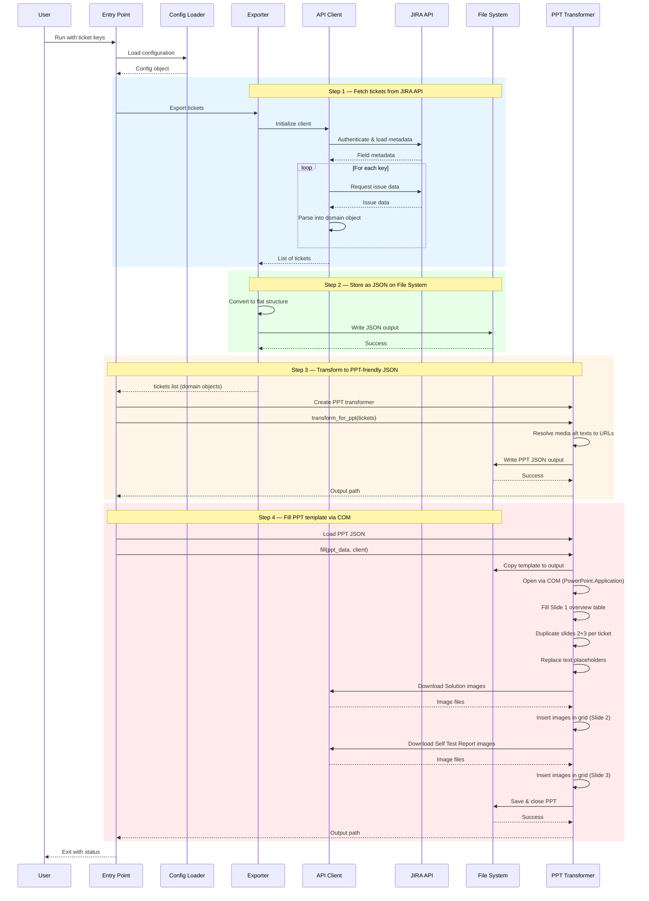

```mermaid
sequenceDiagram
    participant U as User
    participant M as Entry Point
    participant C as Config Loader
    participant E as Exporter
    participant J as API Client
    participant API as JIRA API
    participant F as File System
    participant P as PPT Transformer

    U->>M: Run with ticket keys
    M->>C: Load configuration
    C-->>M: Config object

    rect rgb(230, 245, 255)
    Note over E,F: Step 1 — Fetch tickets from JIRA API
    M->>E: Export tickets
    E->>J: Initialize client
    J->>API: Authenticate & load metadata
    API-->>J: Field metadata
    loop For each key
        J->>API: Request issue data
        API-->>J: Issue data
        J->>J: Parse into domain object
    end
    J-->>E: List of tickets
    end

    rect rgb(230, 255, 230)
    Note over E,F: Step 2 — Store as JSON on File System
    E->>E: Convert to flat structure
    E->>F: Write JSON output
    F-->>E: Success
    end

    rect rgb(255, 245, 230)
    Note over M,P: Step 3 — Transform to PPT-friendly JSON
    E-->>M: tickets list (domain objects)
    M->>P: Create PPT transformer
    M->>P: transform_for_ppt(tickets)
    P->>P: Resolve media alt texts to URLs
    P->>F: Write PPT JSON output
    F-->>P: Success
    P-->>M: Output path
    end

    rect rgb(255, 235, 235)
    Note over M,F: Step 4 — Fill PPT template via COM
    M->>P: Load PPT JSON
    M->>P: fill(ppt_data, client)
    P->>F: Copy template to output
    P->>P: Open via COM (PowerPoint.Application)
    P->>P: Fill Slide 1 overview table
    P->>P: Duplicate slides 2+3 per ticket
    P->>P: Replace text placeholders
    P->>J: Download Solution images
    J-->>P: Image files
    P->>P: Insert images in grid (Slide 2)
    P->>J: Download Self Test Report images
    J-->>P: Image files
    P->>P: Insert images in grid (Slide 3)
    P->>F: Save & close PPT
    F-->>P: Success
    P-->>M: Output path
    end

    M-->>U: Exit with status
```

