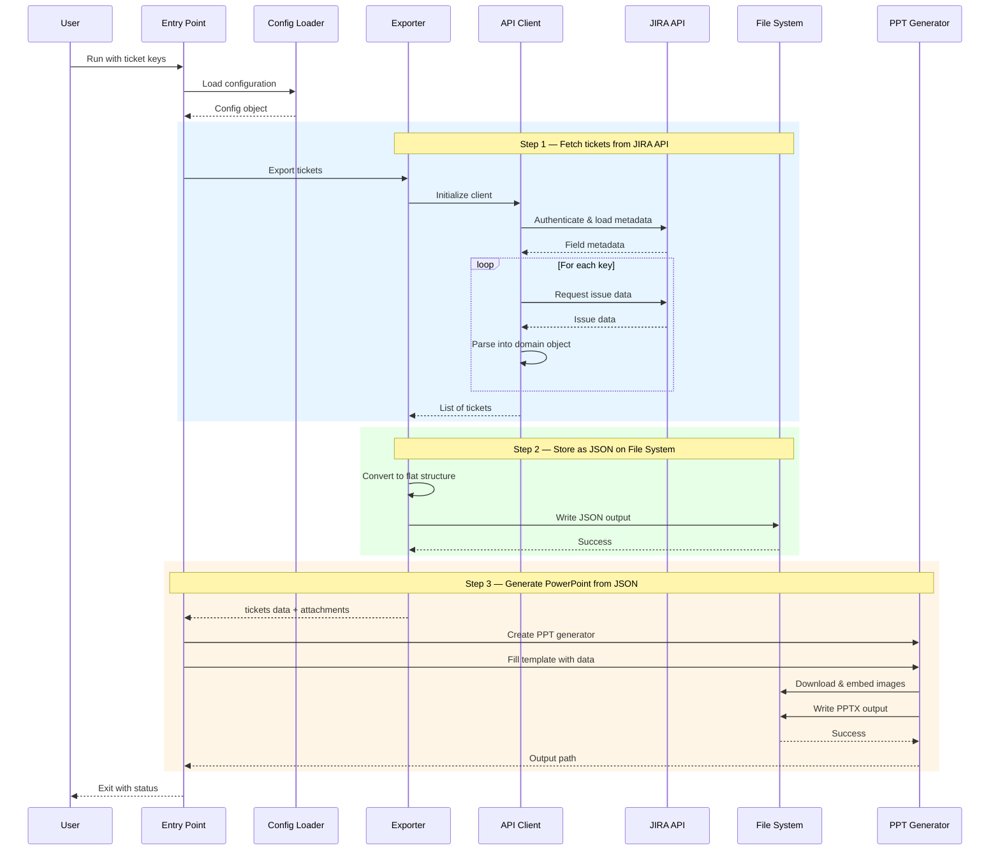

```mermaid
sequenceDiagram
    participant U as User
    participant M as Entry Point
    participant C as Config Loader
    participant E as Exporter
    participant J as API Client
    participant API as JIRA API
    participant F as File System
    participant P as PPT Generator

    U->>M: Run with ticket keys
    M->>C: Load configuration
    C-->>M: Config object

    rect rgb(230, 245, 255)
    Note over E,F: Step 1 — Fetch tickets from JIRA API
    M->>E: Export tickets
    E->>J: Initialize client
    J->>API: Authenticate & load metadata
    API-->>J: Field metadata
    loop For each key
        J->>API: Request issue data
        API-->>J: Issue data
        J->>J: Parse into domain object
    end
    J-->>E: List of tickets
    end

    rect rgb(230, 255, 230)
    Note over E,F: Step 2 — Store as JSON on File System
    E->>E: Convert to flat structure
    E->>F: Write JSON output
    F-->>E: Success
    end

    rect rgb(255, 245, 230)
    Note over M,P: Step 3 — Generate PowerPoint from JSON
    E-->>M: tickets data + attachments
    M->>P: Create PPT generator
    M->>P: Fill template with data
    P->>F: Download & embed images
    P->>F: Write PPTX output
    F-->>P: Success
    P-->>M: Output path
    end

    M-->>U: Exit with status
```

