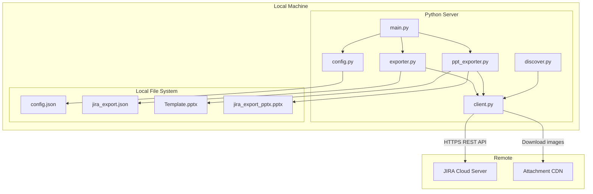
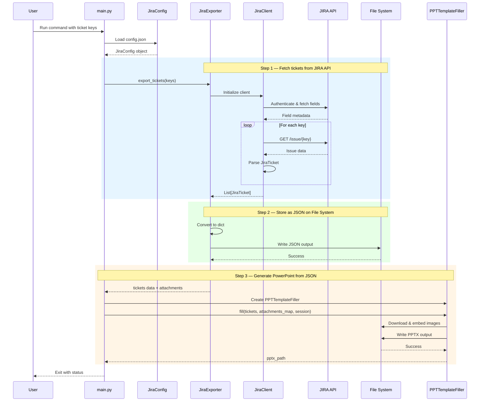

# JIRA Exporter - Architecture Design

## Component Overview

```mermaid
graph TB
    subgraph Local Machine
        subgraph Python Server
            M[main.py]
            C[config.py]
            E[exporter.py]
            CL[client.py]
            P[ppt_exporter.py]
            D[discover.py]
        end
        subgraph Local File System
            CFG[config.json]
            JSON[jira_export.json]
            TMPL[Template.pptx]
            PPTX[jira_export_pptx.pptx]
        end
    end

    subgraph Remote
        JIRA[JIRA Cloud Server]
        ATT[Attachment CDN]
    end

    M --> C
    M --> E
    M --> P
    E --> CL
    P --> CL
    D --> CL

    C --> CFG
    E --> JSON
    P --> TMPL
    P --> PPTX

    CL -->|HTTPS REST API| JIRA
    CL -->|Download images| ATT
```

## Pipeline Sequence

```mermaid
sequenceDiagram
    participant U as User
    participant M as main.py
    participant C as JiraConfig
    participant E as JiraExporter
    participant J as JiraClient
    participant API as JIRA API
    participant F as File System
    participant P as PPTTemplateFiller
    
    U->>M: Run command with ticket keys
    M->>C: Load config.json
    C-->>M: JiraConfig object
    
    rect rgb(230, 245, 255)
    Note over E,F: Step 1 — Fetch tickets from JIRA API
    M->>E: export_tickets(keys)
    E->>J: Initialize client
    J->>API: Authenticate & fetch fields
    API-->>J: Field metadata
    loop For each key
        J->>API: GET /issue/{key}
        API-->>J: Issue data
        J->>J: Parse JiraTicket
    end
    J-->>E: List[JiraTicket]
    end
    
    rect rgb(230, 255, 230)
    Note over E,F: Step 2 — Store as JSON on File System
    E->>E: Convert to dict
    E->>F: Write JSON output
    F-->>E: Success
    end
    
    rect rgb(255, 245, 230)
    Note over M,P: Step 3 — Generate PowerPoint from JSON
    E-->>M: tickets data + attachments
    M->>P: Create PPTTemplateFiller
    M->>P: fill(tickets, attachments_map, session)
    P->>F: Download & embed images
    P->>F: Write PPTX output
    F-->>P: Success
    P-->>M: pptx_path
    end
    
    M-->>U: Exit with status
```

